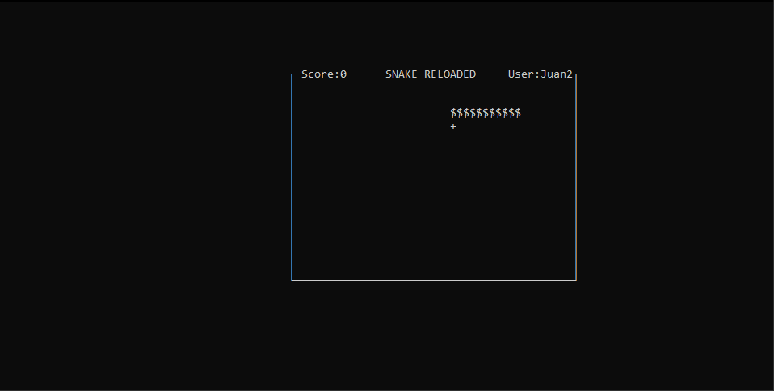
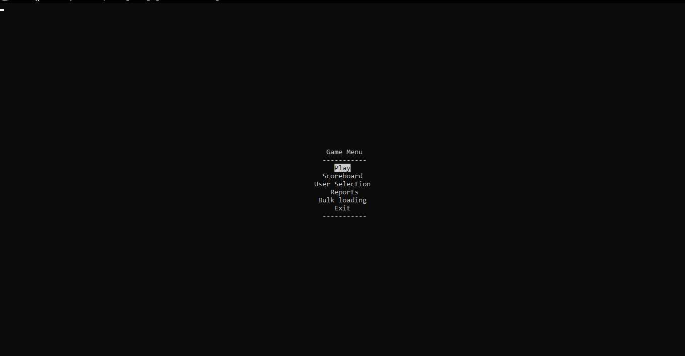
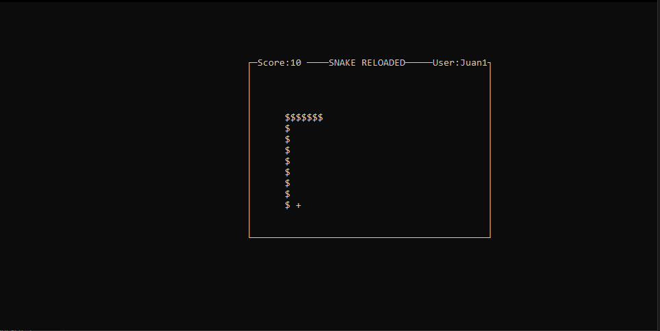
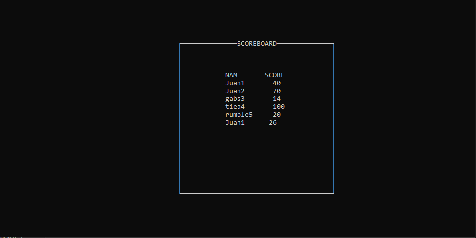
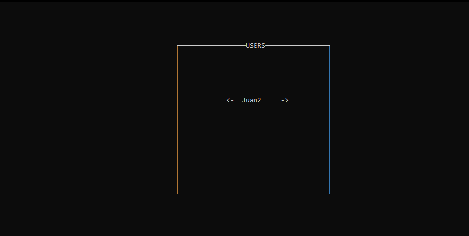
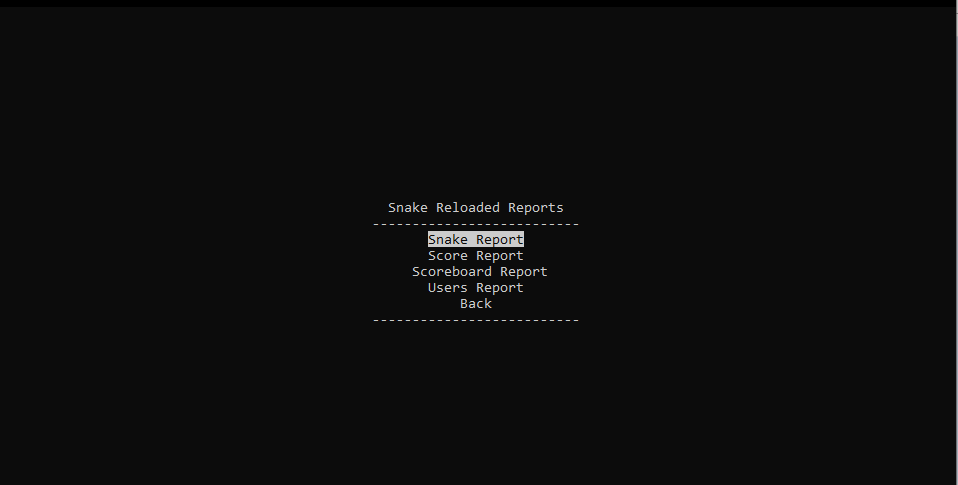

# Snake Reloaded
Juan Antonio Pineda Espino - Practica 1 - Estructuras de Datos - Data Structures

| Nombre                             | Email| 
|------------------------------------|-----------|
| Juan Antonio Pineda Espino              | jpinedaespino@gmail.com |

<hr>

## About the Project

<p align="center"> 
  
</p>

This project puts in practice data structures concepts with a classic snake game.

The snake game lets you create your own username, play, saves your score and shows you a 10 player max scoreboard. There's 4 reports that you can generate to check the state of the structures in the program. Last but not least, you can also bulk load a .csv file with users and scores (Example .csv [Here](usuarios.csv)).

### Built With
* [Python](https://www.python.org)
* [Graphviz](https://graphviz.org)


> :warning: **Important**: Remember this was made for myself-learning purposes. This App was developed in just a week, so there's probably some game breaking bugs lol. :warning:
> :warning: **Important**: All the data structures used in this game are dynamic. And self-created. :] :warning:

<!-- GETTING STARTED -->
## Getting Started
The app should work in Windows (tested in 2023) and Ubuntu (last time I tested was about 3 years ago (2018) or so lol)
### Prerequisites
You need to have installed 
* [Python](https://www.python.org)
* [Graphviz](https://graphviz.org)


### Usage
#### Windows
1. After you have cloned the repo, just go to the **dist** folder, where the .exe is and try the game!

#### Ubuntu
1. Run the menu.py file using the python command in your terminal 
 ```sh
   python Menu.py
   ```
### The Game

To navigate around the menu just use your arrows keys and the Enter key to select an option. When playing you can also pause the game with enter.

<br>
#### 1. Play
The snake is a **Doubly linked list** which allows to save all the positions the snake is, and change it's direction in any given moment.

##### 1.1 Score System
The score system is stored in a **stack** and you get 2 points for each **"+"** you eat, and lose 2 points for each **"*"** you eat.
##### 1.2 New Level 
Everytime you get to 15 points, the speed of the snake goes higher. 
<br>
#### 2. Scoreboard
The scoreboard uses a **queue** to store all the users and their score. and only allows 10 users max. If an 11 user comes, it just gonna overwrite the top of the queue (First in)

<br>
#### 3. User selection
All Users that are created when playing a new game or bulk loaded, get stored in a dynamic **Doubly circular linked list** and you can check them in this menu, select one and play with that name!

<br>
#### 4. Reports
This specific menu is gonna work well only if you have Graphviz installed in your computer. There's 4 reports to choose from and each of them shows the state of a different data structure. 
**All the reports generate a .dot file and the .png file in the Reportes folder**
<br>

##### 4.1 Snake Report (**Doubly linked list**)
This report generates a .png that shows the coords(x,y) where the snake is (paused) or died (game over). You can see an example of this report in here [Snake Report](Reportes/grafsnake.png)
##### 4.2 Score Report  (**Stack**)
The scores reports generates the coords(x,y) where the snake ate any food. Example here [Score Reporte](Reportes/stack.png)
##### 4.3 ScoreBoard Report (**Queue)
The scoreboard reporte generates a .png with the name of all users and it's score. Each node contains a user and a score (user,score). [Example](Reportes/cola.png)
##### 4.4 Users Report (**Doubly Circular linked list**)
This reports shows the state of the doubly circular linked list, each node it's the name of a User. [Example](Reportes/grafcirc.png)
